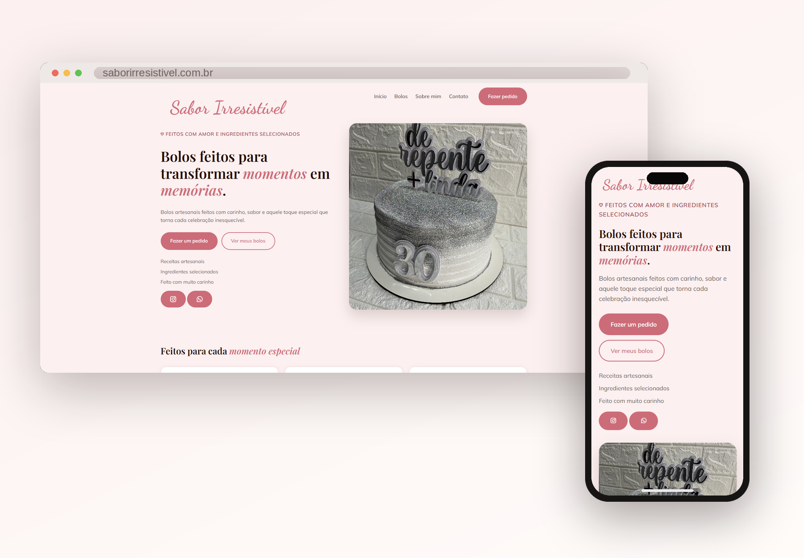

# 🍰 Sabor Irresistível

Landing page desenvolvida para uma confeiteira, com foco em apresentar seus trabalhos, fortalecer sua presença digital e facilitar o contato para pedidos.

> Este projeto começou como um dos meus primeiros projetos durante os estudos de Front-End. Meses depois, retomei o código e reconstruí completamente a experiência, aplicando os conhecimentos que adquiri ao longo desse período.

---

## 🌐 Preview

🔗 **[Acessar o site](https://leonardoftdev.github.io/sbi-projeto/)**

---

## 📸 Sobre o projeto

O **Sabor Irresistível** é uma landing page criada para divulgar o trabalho de uma confeiteira e apresentar seus principais produtos de forma visual, moderna e objetiva.

O projeto foi pensado para que o visitante consiga:

- Conhecer a confeiteira;
- Visualizar seus principais trabalhos;
- Conhecer os diferenciais do serviço;
- Entrar em contato para realizar um pedido;
- Acessar diretamente suas redes sociais.

A página foi desenvolvida com foco em **responsividade, experiência do usuário, acessibilidade e conversão**.

---

## 🚀 Tecnologias utilizadas

### HTML5
Utilizado para estruturar semanticamente todo o conteúdo da página.

### CSS3
Responsável pela identidade visual, layout, responsividade, animações e adaptação para diferentes tamanhos de tela.

### JavaScript
Utilizado para implementar as interações e funcionalidades da página, incluindo a navegação da galeria e o menu mobile.

---

## ✨ Funcionalidades

- [x] Landing page responsiva
- [x] Menu de navegação
- [x] Galeria de bolos
- [x] Navegação entre imagens da galeria
- [x] Botões de contato
- [x] Integração com WhatsApp
- [x] Link para Instagram
- [x] Scroll suave entre seções
- [x] Layout adaptado para dispositivos móveis

---

## 📱 Responsividade

O projeto foi desenvolvido para proporcionar uma boa experiência em diferentes dispositivos:

- 💻 Desktop
- 💻 Notebook
- 📱 Smartphones
- 📱 Tablets

---

## 🎨 Estrutura da página

A landing page foi organizada nas seguintes seções:

**Hero**
> Apresentação principal da marca e chamada para ação.

**Diferenciais**
> Destaque para os principais pontos do trabalho da confeiteira.

**Meus trabalhos**
> Galeria com alguns dos bolos produzidos.

**Sobre**
> Apresentação da confeiteira responsável pela Sabor Irresistível.

**Contato**
> Área destinada ao contato e realização de pedidos.

---

## 📚 Evolução do projeto

Este projeto possui um significado especial no meu processo de aprendizado.

A primeira versão foi desenvolvida aproximadamente 10 meses antes desta versão, quando eu ainda estava nos primeiros estágios dos meus estudos de desenvolvimento Front-End.

Na época, o projeto possuía uma estrutura mais simples, algumas páginas separadas e uma identidade visual que hoje considero bastante limitada.

Ao retomá-lo, decidi reconstruí-lo como uma **landing page**, aplicando conceitos e conhecimentos que adquiri durante esse período.

Entre as principais melhorias estão:

- Nova identidade visual;
- Nova estrutura de página;
- Melhor experiência de navegação;
- Responsividade aprimorada;
- Implementação de JavaScript;
- Galeria interativa;
- Melhor organização do código;
- Melhor acessibilidade;
- Novos textos e conteúdos;
- Melhor utilização das imagens;
- Foco maior em experiência do usuário e conversão.

Este projeto representa não apenas uma página de confeitaria, mas também a **evolução do meu aprendizado em Front-End**.

Link do repositório do projeto anterior : 
https://github.com/leonardoftdev/projeto-sbr
---

## 🧠 Aprendizados

Durante o desenvolvimento e redesign do projeto, pude praticar conceitos como:

- HTML semântico;
- CSS moderno;
- Flexbox;
- CSS Grid;
- Responsividade;
- Media Queries;
- JavaScript e manipulação do DOM;
- Eventos;
- Organização de código;
- Acessibilidade;
- Estruturação de Landing Pages;
- Git e GitHub;
- Deploy utilizando GitHub Pages.

---

## 🔗 Links

🌐 **Site:**  
https://leonardoftdev.github.io/sbi-projeto/

💻 **Repositório:**
https://github.com/leonardoftdev/sbi-projeto

💻 **Repositório do projeto anterior:**
https://github.com/leonardoftdev/projeto-sbr

🌐 **Linkedin:**
https://www.linkedin.com/in/leonardoftdev/
---

## 👨‍💻 Desenvolvedor

Desenvolvido por **Leonardo** durante meus estudos e evolução como desenvolvedor Front-End.

